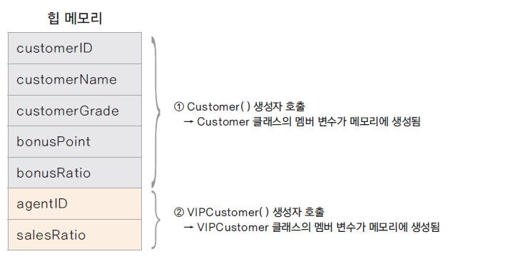
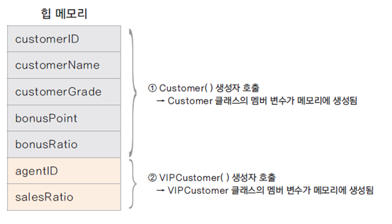
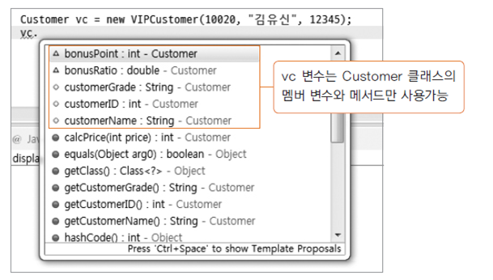
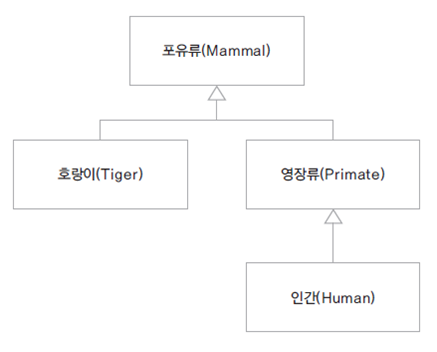

###상속에서 인스턴스 메모리의 상태
- 항상 상위 클래스의 인스턴스가 먼저 생성되고, 하위 클래스의 인스턴스가 생성 됨



###형 변환(업캐스팅)
- 상위 클래스로 변수를 선언하고 하위 클래스의 생성자로 인스턴스를 생성
<br>
```Customer customerLee = new VIPCustomer();```

- 상위 클래스 타입의 변수에 하위 클래스 변수가 대입;
<br>
```VIPCustomer vCustomer = new VIPCustomer();```
<br>
```addCustomer(vCustomer);```
<br>
```int addCustomer(Customer customer){}```


- 하위 클래스는 상위 클래스의 타입을 내포하고 있으므로 상위 클래스로의 묵시적 형 변환이 가능함
- 상속 관계에서 모든 하위 클래스는 상위 클래스로 형 변환(업캐스팅)이 됨 (그 역은 성립하지 않음)
- (LSP (Liskov Substitution Principle) 리스코프 치환 원칙)

###형 변환과 메모리
- Customer vc = new VIPCustomer(); 에서 vc가 가리키는 것은?
- VIPCustomer() 생성자에 의해 VIPCustomer 클래스의 모든 멤버 변수에 대한 메모리는 생성되었지만,
- 변수의 타입이 Customer 이므로 실제 접근 가능한 변수나 메서드는 Customer의 변수와 메서드임



###클래스의 계층구조가 여러 단계인 경우

<br>
- Human은 내부적으로 Promate와 mammal의 타입을 모두 내포하고 있음
- Primate pHumman = new Humman();
- Mammal mHumman = new Humman();